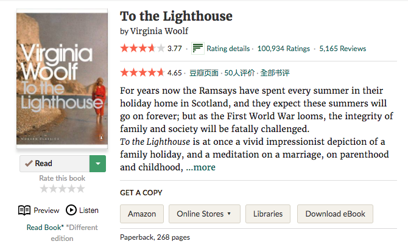

# db-goodreads
Userscript and chrome extension for showing goodreads ratings on douban book, and vice versa.

### On douban.com

### On goodreads.com

## How to use the userscript
1. Get api key from https://www.goodreads.com/api/keys
2. Enter your apikey in the script
3. Load the usercript/script.js in an userscript manager(e.g. Tampermonkey).

